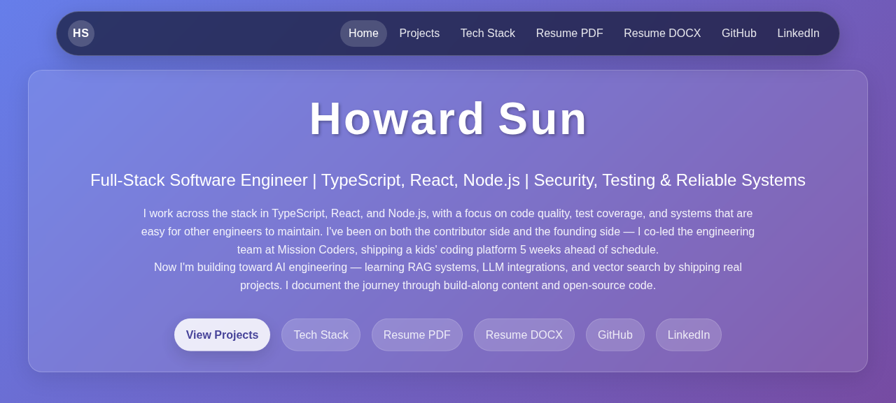
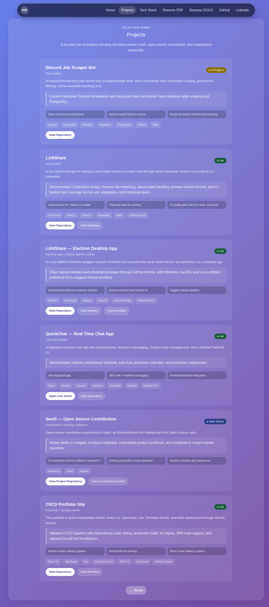
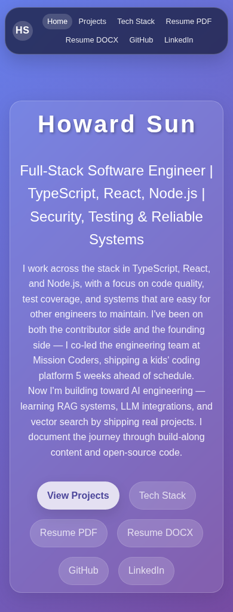

# 🌐 Howard Sun — Full-Stack Engineer & Builder

[](https://github.com/howardsun-dev/cicd-portfolio/actions/workflows/main.yml)
[](https://howardsun.me)


Welcome to my portfolio. I'm a full-stack engineer with backend and infrastructure roots, currently building full-stack, desktop, CI/CD, and developer tooling projects end to end.

Live site: [howardsun.me](https://howardsun.me)

## 🎯 What I'm About

I build practical software from the system layer up: APIs, realtime services, local tooling, desktop wrappers, cloud deployment, and polished frontend experiences. My infrastructure background means I don't just write code — I care about how it runs, ships, and fails.

**Currently focused on:**
- Building full-stack projects with TypeScript, React, and Node.js
- Shipping CI/CD-backed projects with automated lint/build/test gates
- Building desktop and local-first tooling with Electron, CLI workflows, and release pipelines
- Learning AI/ML engineering — RAG systems, LLM integrations, embeddings, and AI-assisted workflows
- Contributing to open source

## 🧠 Tech Stack

- **Languages:** TypeScript, JavaScript (ES6), Python, C++
- **Frontend:** React, Redux Toolkit, Zustand, TanStack Router, React Router, HTML5, CSS3/Sass, Tailwind CSS, Material UI, DaisyUI, Chart.js, webpack, Vite
- **Backend & APIs:** Node.js, Express, WebSocket, Socket.IO, REST APIs, JWT Authentication, Cloudinary, Arcjet
- **Desktop & Tooling:** Electron, electron-builder, CLI tools, Git, Figma
- **Databases:** PostgreSQL, MongoDB, Amazon Aurora
- **Infrastructure & Cloud:** AWS EC2, AWS S3, AWS Elastic Beanstalk, AWS VPC, CloudFront, ELB/ALB, Docker, GitHub Actions
- **Testing:** Jest, Playwright, Mocha, Chai, Vitest

## 🚀 Featured Projects

### LANShare
A tiny TypeScript app for sharing a local folder across a trusted LAN through either a browser control UI or a direct CLI command.
- **Role:** Solo builder
- **Tech:** TypeScript, Node.js, Express, Playwright, Vitest, GitHub Actions
- **Proof:** Local control UI + direct CLI mode, traversal-safe file serving, CI quality gate with lint/tests/build
- **GitHub:** [howardsun-dev/LANShare](https://github.com/howardsun-dev/LANShare)
- **Workflow:** [LANShare CI](https://github.com/howardsun-dev/LANShare/actions/workflows/ci.yml)

### LANShare — Electron Desktop App
A cross-platform Electron wrapper around LANShare that launches the local control server and presents it as a desktop app.
- **Role:** Desktop app + release pipeline owner
- **Tech:** Electron, TypeScript, Node.js, Express, electron-builder, GitHub Actions
- **Proof:** Windows/macOS/Linux release artifacts, Electron-hosted local control UI, tagged release pipeline
- **GitHub:** [howardsun-dev/LANShare-electron](https://github.com/howardsun-dev/LANShare-electron)
- **Release:** [v1.0.1](https://github.com/howardsun-dev/LANShare-electron/releases)
- **Workflow:** [Release workflow](https://github.com/howardsun-dev/LANShare-electron/actions/workflows/release.yml)

### QuickChat — Real-Time Chat App
A deployed full-stack realtime chat app with authentication, Socket.IO messaging, Zustand state management, and a polished Tailwind CSS UI.
- **Role:** Full-stack builder
- **Tech:** React, Node.js, Express, Socket.IO, MongoDB, Zustand, Tailwind CSS
- **Live Demo:** [quickchat-v72jh.sevalla.app](https://quickchat-v72jh.sevalla.app/login)
- **GitHub:** [howardsun-dev/quickchat](https://github.com/howardsun-dev/quickchat)

### Discord Job Scraper Bot
A Discord bot that turns job search into a programmable feed: slash commands now, scheduled scraping, persistence, filtering, and AI-assisted matching next.
- **Role:** Solo builder
- **Tech:** Node.js, TypeScript, discord.js, Puppeteer, PostgreSQL, Docker, AWS
- **Status:** In Progress — slash-command architecture is in place; scraping, persistence, and filtering are next
- **GitHub:** [howardsun-dev/discord-job-scraper](https://github.com/howardsun-dev/discord-job-scraper)

### Swell — Open Source Contribution
Open-source contribution experience in Swell, an Electron/React API testing tool from Open Source Labs.
- **Role:** Contributor in existing codebase
- **Tech:** Electron.js, React, Node.js
- **Repo:** [open-source-labs/Swell](https://github.com/open-source-labs/Swell)
- **Commit:** [Co-authored contribution](https://github.com/open-source-labs/Swell/commit/964142802b6a09362bd16c968501d511c3f42858)

### CI/CD Portfolio Site
This portfolio is itself a deployable artifact: React 19, TypeScript, Vite, TanStack Router, and AWS deployment through GitHub Actions.
- **Role:** Frontend + DevOps owner
- **Tech:** React 19, TypeScript, Vite, TanStack Router, AWS S3, CloudFront, GitHub Actions
- **GitHub:** [howardsun-dev/cicd-portfolio](https://github.com/howardsun-dev/cicd-portfolio)
- **Workflow:** [Deploy Portfolio to AWS S3](https://github.com/howardsun-dev/cicd-portfolio/actions/workflows/main.yml)

## 🏗️ Architecture

This portfolio is a static React application deployed through a GitHub Actions pipeline into AWS-hosted static infrastructure.

▶ **[View the editable Excalidraw architecture diagram](https://excalidraw.com/#json=yfXp3Zq0CcyA_uIKxqfy_,xrJuxUvJL5N82ebCd9zapw)**

**Build path:**

1. Source code lives in GitHub on the `main` branch.
2. GitHub Actions runs the deployment workflow on pushes to `main`.
3. The workflow installs dependencies with `npm install --legacy-peer-deps`, runs `npm audit --audit-level=critical`, lints the codebase, and builds the app with Vite.
4. Vite outputs production-ready static assets into `dist/`.
5. The workflow syncs `dist/` to an AWS S3 bucket configured for static site hosting.
6. The deploy script also uploads SPA route fallback files so direct navigation to `/project` and `/techstack` works after refresh.
7. CloudFront sits in front of S3 to provide HTTPS, caching, and faster global delivery. If `CLOUDFRONT_DISTRIBUTION_ID` is configured, the workflow can invalidate the CDN cache after deployment.

**Runtime path:** browser → CloudFront → S3 static assets → React/TanStack Router renders the page client-side.

## 🔑 Key Engineering Features

- Automated CI/CD deployment pipeline with GitHub Actions
- Production builds deployed to AWS S3 + CloudFront
- SPA route fallback support for client-side routing
- Cache-aware deployment strategy for HTML assets
- Type-safe React 19 + TypeScript architecture
- Modular routing using TanStack Router
- Dependency auditing and linting in CI workflows

## 🖼️ Screenshots

### Homepage

*The homepage features the animated name constellation, profile section with new "Contact" button and "Open to" line, and project constellation visualization.*

### Projects section

*The projects section displays enhanced project cards featuring media previews (GIFs/images), proof points, technology stacks, and proof badges showing CI status, releases, and deployment information.*

### Mobile view

*The mobile view demonstrates responsive design with the profile section, project constellation (in reduced motion mode), and easy navigation to all sections.*

## 🔁 CI/CD

The deploy workflow validates the app before shipping:

1. Install dependencies with `npm install --legacy-peer-deps`
2. Run `npm audit --audit-level=critical`
3. Run ESLint
4. Build the React/Vite app
5. Deploy `dist/` to S3 on pushes to `main`
6. Upload SPA route fallbacks for direct `/project` and `/techstack` navigation
7. Optionally invalidate CloudFront if `CLOUDFRONT_DISTRIBUTION_ID` is configured as a repository variable

## 🧑‍💻 Local Development

```bash
npm install --legacy-peer-deps
npm run dev
npm run lint
npm run build
npm run preview
```

- `npm run dev` starts the Vite dev server for local iteration.
- `npm run build` runs the same TypeScript + Vite production build used by CI.
- `npm run preview` serves the built `dist/` output locally for a production-like smoke test.

## 📬 Connect

- **Website:** [howardsun.me](https://howardsun.me)
- **LinkedIn:** [linkedin.com/in/howardsun-swe](https://linkedin.com/in/howardsun-swe)
- **GitHub:** [github.com/howardsun-dev](https://github.com/howardsun-dev)
- **Resume:** [PDF](https://howardsun.me/resume/Howard_Sun-Resume-2026.pdf) | [DOCX](https://howardsun.me/resume/Howard_Sun-Resume-2026.docx)
- **Email:** [howardsun@pm.me](mailto:howardsun@pm.me)

## 🌱 What's Next

I'm currently learning AI/ML engineering — building RAG systems, experimenting with LLM integrations, and looking for ways to add useful AI behavior to practical products rather than chasing demos.